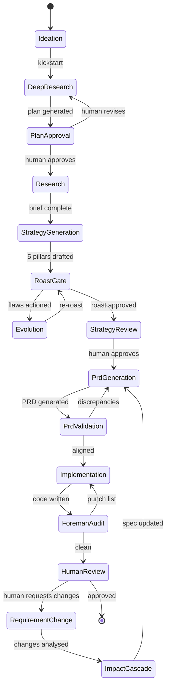

# BushidoOS: The AI Development Orchestrator

> *"The way of the warrior is the way of discipline. Code without specification is a blade without a master."*

---

## The Problem

Every team building with AI coding agents today hits the same wall:

1. **The Drift Problem** — You start with a spec. The agent builds. But each iteration introduces subtle deviations. By sprint 3, the codebase has drifted so far from the original vision that the spec is fiction.

2. **The Stale PRD Problem** — Specs are written once, then abandoned. Requirements change through verbal conversations, Slack messages, and "just add this one thing" prompts. The PRD becomes a historical artifact, not a living contract.

3. **The Lazy Agent Problem** — AI coding agents optimise for *completion*, not *correctness*. They cut corners, skip edge cases, and produce "looks right at first glance" code. The human, exhausted from context-switching between preview and editor, approves it.

4. **The Context Loss Problem** — When requirements change, there's no mechanism to propagate that change through every downstream artifact. New features break old ones. Constraints are silently violated. Nobody notices until production.

5. **The Human Bottleneck** — The developer is simultaneously the PM, the QA engineer, the reviewer, and the prompt engineer. This doesn't scale.

---

## The Vision

**BushidoOS is not a product strategy app. It is an AI Product Manager that orchestrates the entire development lifecycle — accessible from the terminal, the IDE, and a web dashboard, all kept in sync through a single source of truth.**

```
┌──────────────────────────────────────────────────────────────────────┐
│                    THE HUMAN (Founder / PM / Developer)              │
│  "I want X" / "Change Y" / "The user research says Z"              │
└──────┬──────────────────────┬───────────────────────┬───────────────┘
       │ CLI (quick actions)  │ Web (deep dives)      │ IDE (coding)
       ▼                     ▼                        ▼
┌──────────────────────────────────────────────────────────────────────┐
│                      BUSHIDO OS (The PM Agent)                       │
│                                                                      │
│  ┌──────────┐ ┌──────────┐ ┌──────────┐ ┌──────────┐ ┌──────────┐  │
│  │ Living   │ │ Roast    │ │ Foreman  │ │ Impact   │ │ Converse │  │
│  │ PRD      │ │ Swarm    │ │ Auditor  │ │ Checker  │ │ Engine   │  │
│  └──────────┘ └──────────┘ └──────────┘ └──────────┘ └──────────┘  │
│                                                                      │
│  ┌───────────────────────────────────────────────────────────────┐   │
│  │              .bushido/ (The Single Source of Truth)            │   │
│  │  spec.json │ prd.json │ strategy.md │ .cursorrules │ sync.json │   │
│  └───────────────────────────────────────────────────────────────┘   │
│              ▲               ▲               ▲                       │
│         CLI reads/writes  Cloud sync    MCP reads/writes             │
└──────────────────────────────┬───────────────────────────────────────┘
                               │ MCP / CLI / .cursorrules
                               ▼
┌──────────────────────────────────────────────────────────────────────┐
│                    CODING AGENTS (Workers)                            │
│              Cursor / Windsurf / Copilot / Claude                    │
│                                                                      │
│  "Build feat-3 per spec.json. Report when done."                    │
└──────────────────────────────────────────────────────────────────────┘
```

The human talks to BushidoOS through whichever interface suits the moment. BushidoOS talks to the coding agents. The coding agents never talk to the human directly about *what* to build — only *how* it's going.

---

## The 7 Bushido Principles, Applied

These aren't just metaphors — they're architectural constraints.

### 1. 義 Gi (Righteousness) — The Spec is the Law

> Every line of code must trace back to a requirement in `spec.json`.

**Architectural implication:** The `spec.json` is the single source of truth. It is a machine-readable contract (Zod-validated [SpecSchema](file:///Users/pc/BushidoOS/types/beads.ts#54-55)) that defines features, constraints, entities, roles, API endpoints, and non-functional requirements. No code exists without a corresponding spec entry.

**Edge case: What happens when code exists that ISN'T in the spec?**
The Foreman Agent's alignment audit flags this as `extra_code` drift. The system presents two options: (a) delete the code, or (b) update the spec to officially include it. Code cannot exist in a grey area — it's either sanctioned or it's drift.

### 2. 勇 Yū (Courage) — The Roast Gate

> Have the courage to hear your strategy is flawed before you build it.

**Architectural implication:** Before any code is written, the full strategy passes through a 4-persona adversarial roast (CEO, Senior Engineer, Lead Designer, Growth Hacker). Each persona attributes their flaws and suggestions to specific pillars. The system then *evolves* affected pillar artifacts based on actioned feedback.

**Edge case: What if the roast score is terrible but the human disagrees?**
BushidoOS respects the human's authority but logs the override as a "courage override" — a conscious decision to proceed despite warnings. If the product later fails in the area the roast predicted, the system can surface this decision in a retrospective. The spec is annotated with `⚠️ Overridden Roast Warning` metadata.

### 3. 仁 Jin (Benevolence) — The User Persona is Sacred

> Every feature must serve a real person, not a hypothetical one.

**Architectural implication:** User stories in the PRD are validated against the persona artifact. The alignment service checks that acceptance criteria map to actual pain points, not invented ones. If a feature is added that doesn't trace to a persona pain point, the system flags it as `ungrounded_feature`.

**Edge case: What if the persona evolves mid-project?**
When the human says *"our user research shows the persona is actually younger than we thought"*, BushidoOS doesn't just update the persona artifact. It runs an impact cascade:
1. Which features assumed the old persona?
2. Which acceptance criteria assumed the old demographics?
3. Which business model assumptions are now invalid?
The system presents this cascade to the human before applying changes.

### 4. 礼 Rei (Respect) — Respect the Process

> Don't skip steps. Don't cut corners. The pipeline exists to protect you.

**Architectural implication:** The pipeline is a strict state machine. You cannot generate a PRD without validated strategy pillars. You cannot start coding without an approved PRD. You cannot ship without a Foreman audit. Each gate requires explicit human approval or a logged override.



**Edge case: What if the coding agent claims it's done but hasn't run tests?**
The Foreman Agent doesn't trust self-reports. It reads the actual code, runs the alignment audit against `prd.json`, and generates a punch list. The coding agent only gets credit when the audit score meets the threshold.

### 5. 誠 Makoto (Honesty) — No Hallucination Cascades

> If you don't know, say so. If you're guessing, mark it.

**Architectural implication:** The `ArtifactValidator` enforces structural completeness — Market Analysis must have Competitors, Risks, and Opportunities sections. The [runSpecComplianceAudit](file:///Users/pc/BushidoOS/services/ai/agents/alignmentService.ts#43-73) checks that the PRD faithfully captures the spec without adding hallucinated features ("amnesia" and "hallucination" detection).

The **Distillation Service** exists for honesty in the feedback loop: when an alignment report finds discrepancies, it doesn't just say "fix it." It distills *key learnings* and *suggested spec updates*, feeding them back upstream. The spec evolves honestly based on what was learned during implementation.

**Edge case: What if the AI model hallucinates a competitor that doesn't exist?**
Research is grounded through Tavily web search with source harvesting. Every claim in the research brief should have a source. The system includes `Source[]` metadata on artifacts. During the roast, the CEO persona specifically challenges market claims — if a competitor is fabricated, the roast should catch it. In the future, a dedicated fact-checking agent could validate each source URL.

### 6. 名誉 Meiyo (Honour) — The Living PRD

> Your word is your bond. The PRD is the project's honour.

**Architectural implication:** This is the core innovation. The PRD isn't a static document — it's a **Living PRD** that:

1. **Updates when requirements change** — When the human says "add OAuth support", the system doesn't just add a feature. It runs an `ImpactChecker` to determine if this is structural (requires spec update, cascade check) or cosmetic (can be a quick edit).

2. **Versions itself** — Every spec change creates a new version with a changelog. `prd.json` includes `version` and `lastUpdated` fields.

3. **Propagates downstream** — When the spec changes, the system identifies affected artifacts (`handleEditSave → downstream detection`) and marks them for review or regeneration.

4. **Never loses history** — Previous versions of the spec are preserved as beads. If a decision is reversed ("actually, we don't need OAuth"), the system can revert to a previous version while preserving any non-conflicting changes made since.

**Edge case: Two conflicting requirement changes arrive at the same time.**
The Impact Checker runs in sequence. The second change is analysed against the spec *as modified by the first change*. If they conflict, the system surfaces the conflict to the human: "Adding 'free tier' conflicts with the 'premium-only' pricing model added 10 minutes ago. Which takes precedence?"

### 7. 忠義 Chūgi (Loyalty) — The Foreman Never Sleeps

> Be loyal to the spec, not to the agent's convenience.

**Architectural implication:** The Foreman Agent is the final quality gate. It reads actual source code files and audits them against the PRD. It produces a `PunchList` — a list of specific violations with suggested fixes. The coding agent doesn't ship until the punch list is empty.

The Foreman is *loyal to the spec*, not to the coding agent. If the coding agent says "I couldn't implement X because it's too complex," the Foreman doesn't accept that. It flags it as a `missing_file` or `logic_drift` issue and sends it back.

**Edge case: What if the Foreman itself makes a mistake?**
The human always has the ability to override the Foreman ("this is fine, mark as accepted"). The override is logged. Over time, the pattern of overrides becomes a signal — if the human consistently overrides a certain type of check, perhaps the spec needs clarification in that area.

---

## Architecture: The Three Loops

The system operates as three nested feedback loops:

### Loop 1: Strategy → Spec (Outer Loop — Human-Driven)

```
Human idea → Deep Research → 5 Pillars → Roast → Evolve → PRD → Spec
                                                                  ↑
                                                                  │
Human says "change X" → Impact Cascade → Spec Update → PRD Regen ─┘
```

**Frequency:** Days to weeks. Triggered by business decisions, user research, or market changes.

**BushidoOS role:** Full ownership. Researches, generates, roasts, evolves, and packages the strategy into a machine-readable spec. The human validates and approves.

### Loop 2: Spec → Code (Inner Loop — Agent-Driven)

```
PRD → Task Breakdown → Coding Agent executes → Foreman Audit → Punch List
  ↑                                                                    │
  └────────────────── Agent fixes ← ─ ─ ─ ─ ─ ─ ─ ─ ─ ─ ─ ─ ─ ─ ─ ─┘
```

**Frequency:** Hours. Continuous during active development.

**BushidoOS role:** Orchestrator. Breaks the PRD into tasks, delegates to the coding agent, reviews the agent's work via Foreman audit, sends back punch lists, and only presents the finished result to the human.

### Loop 3: Code → Spec (Feedback Loop — Learning)

```
Foreman finds discrepancy → Distillation → Strategic Update → Spec evolves
```

**Frequency:** After each Foreman audit cycle.

**BushidoOS role:** Learner. When implementation reveals that the spec was ambiguous, incomplete, or wrong, the Distillation Service extracts learnings and proposes spec updates. The spec grows more precise over time — it *learns from implementation*.

---

## Concrete: What the User Actually Experiences

### Persona: Tayo — Solo Founder Building a Fintech App

Tayo has an idea for a savings app targeting Gen-Z Nigerians. He uses BushidoOS from his IDE terminal.

#### Day 1: From Idea to Validated Strategy

```
$ bushido kickstart "AI-powered savings app for Gen-Z Nigerians with 
  automated round-ups and peer savings circles"

🔬 Research Agent starting...
  ├─ Analysing Nigerian fintech market (TAM: ₦2.1T mobile money market)
  ├─ Mapping competitors: PiggyVest, Cowrywise, Kuda
  ├─ Identifying risks: CBN regulations, NDPR compliance
  └─ Research complete. 4,200 words. 12 sources.

📋 Research Plan (5 Pillars):
  1. Market Analysis → Validate TAM/SAM for Gen-Z savings in Nigeria
  2. User Persona → Map Gen-Z saving behaviour and trust barriers
  3. Solution Concept → Design round-up mechanics and peer circle UX
  4. Product Spec → Define MVP features and acceptance criteria
  5. Execution Roadmap → 12-week sprint plan

Approve plan? [Y/n/revise]:
```

Tayo types `revise: also look at regulatory requirements for holding customer funds in Nigeria`.

The plan updates. He approves. The full pipeline runs.

```
🔥 Roast Gate:
  CEO (72/100): "Unit economics unclear — what's CAC for Gen-Z? 
                 PiggyVest spent ₦2B on marketing."
  Engineer (85/100): "Approved. Round-up API is feasible via Mono/Paystack."
  Designer (68/100): "Peer circles need better trust signals. Gen-Z won't 
                      save with strangers."
  Growth (78/100): "Referral loop is weak. Add social proof mechanics."

Overall: 76/100. 1/4 approved outright.

Action items:
  [1] ✓ Add CAC analysis → MARKET_ANALYSIS
  [2] ✓ Add trust verification for circles → USER_PERSONA
  [3] ✓ Add social proof mechanics → SOLUTION_CONCEPT
  [4] ○ Skip remaining

Evolving 3 pillars... Done.
Strategy V2 generated. Spec saved to .bushido/spec.json
```

#### Day 3: Coding with a PM That Doesn't Sleep

Tayo opens Cursor. The `.cursorrules` file is already configured. He tells Cursor: "Build the savings dashboard."

What Cursor doesn't know is that BushidoOS is watching. Via the MCP server:

```
[BushidoOS MCP] Cursor requested context for "savings dashboard"
  ├─ Relevant stories: USR-003 (Dashboard), USR-004 (Balance Display)
  ├─ Constraints: React Native + Expo, Paystack integration
  ├─ Non-negotiables: NDPR compliance, end-to-end encryption
  └─ Injecting context into agent prompt...
```

After Cursor writes the code:

```
$ bushido audit

🔍 Foreman Audit:
  Score: 67/100
  
  PUNCH LIST:
  ├─ [CRITICAL] Missing NDPR consent modal (Non-Negotiable #3 violated)
  ├─ [WARNING] Balance display uses Number type — should use Dinero.js 
  │            for currency safety (Constraint: codingStandards)
  └─ [WARNING] No loading state for dashboard — USR-003 AC #2 not met

  Sending punch list to coding agent...
```

BushidoOS doesn't bother Tayo with this. It sends the punch list back to Cursor via MCP:

```
[BushidoOS MCP → Cursor] Fix these before presenting to the human:
  1. Add NDPR consent modal before any data collection
  2. Replace Number with Dinero.js for all currency values
  3. Add skeleton loading state to dashboard
```

Cursor fixes all three. Foreman re-audits. Score: 94/100. Now Tayo sees it.

#### Week 2: Requirements Change

Tayo's advisor says: "Add a family savings plan — parents save for kids."

```
$ bushido change "Add family savings plan where parents can create 
  goals for their children with automated contributions"

🔍 Impact Analysis:
  ├─ STRUCTURAL CHANGE detected (not cosmetic)
  ├─ Affected pillars:
  │   ├─ USER_PERSONA → Need child persona + parent-child relationship
  │   ├─ PRODUCT_SPEC → New entity: FamilyPlan, new role: parent
  │   ├─ SOLUTION_CONCEPT → New user flow, parental controls
  │   └─ EXECUTION_ROADMAP → Sprint 3 scope increase
  │
  ├─ Non-breaking: Existing peer circles feature unchanged ✓
  ├─ Breaking: Need KYC for minors (regulatory implication) ⚠️
  │
  └─ 4 stories added, 2 stories modified, 0 stories removed

  Spec changes:
    + feat-7: Family Savings Plan (critical)
    + feat-8: Parental Controls (high)
    ~ feat-3: Dashboard updated (add family tab)
    ~ feat-5: Notifications updated (add family alerts)

Apply changes? [Y/n/review details]:
```

Tayo approves. The spec updates. Downstream artifacts regenerate. The Foreman knows that existing code for peer circles is still valid — it only flags the *new* requirements as unimplemented.

**No requirements were damaged. The cycle continues.**

---

## Technical Architecture

### Terminal Interface Layer

```
bushido                          ← CLI entry point (Node.js)
  ├─ kickstart <idea>            ← Full research → strategy pipeline
  ├─ change <description>        ← Requirement change with impact cascade
  ├─ audit                       ← Run Foreman against current codebase
  ├─ status                      ← Show project state, spec health
  ├─ roast                       ← Re-run adversarial review
  ├─ export                      ← Write .bushido/ bundle
  ├─ diff                        ← Show spec changes since last audit
  ├─ history                     ← Spec version history
  └─ serve                       ← Start MCP server for IDE integration
```

### MCP Integration Layer (IDE-Native)

```
MCP Server (stdio)
  ├─ Resources:
  │   ├─ bushido://spec           ← Current spec.json
  │   ├─ bushido://prd            ← Current prd.json  
  │   ├─ bushido://strategy       ← Strategy context
  │   └─ bushido://punchlist      ← Latest Foreman findings
  │
  ├─ Tools:
  │   ├─ read_bushido_artifact    ← Read any bead
  │   ├─ write_bushido_artifact   ← Write back (with validation)
  │   ├─ run_foreman_audit        ← Trigger code audit
  │   ├─ get_task_context         ← Get relevant stories for a task
  │   ├─ report_completion        ← Agent reports task done
  │   └─ request_spec_change      ← Agent flags spec ambiguity
  │
  └─ Notifications:
      ├─ spec_updated             ← Spec changed, re-read context
      ├─ punch_list_ready         ← New issues to fix
      └─ task_assigned            ← New work available
```

### Core Engine (Existing Primitives, Rewired)

| Primitive | Current State | Orchestrator Role |
|-----------|--------------|-------------------|
| [neuralRouter.ts](file:///Users/pc/BushidoOS/services/ai/neuralRouter.ts) | Selects model per stage | Same — routes all AI calls |
| [modelRegistry.ts](file:///Users/pc/BushidoOS/services/ai/modelRegistry.ts) | Creates provider instances | Same — `process.env` instead of `import.meta.env` |
| [aiService.ts](file:///Users/pc/BushidoOS/services/ai/aiService.ts) | Generates artifacts via streaming | Core generator — called by CLI/MCP |
| [roastService.ts](file:///Users/pc/BushidoOS/services/ai/agents/roastService.ts) | 4-persona adversarial review | Roast Gate in pipeline |
| [strategyService.ts](file:///Users/pc/BushidoOS/services/ai/strategyService.ts) | Summarise → Evolve → Package | Strategy evolution engine |
| [productAgent.ts](file:///Users/pc/BushidoOS/services/ai/agents/productAgent.ts) | Generate → Audit → Fix loop | PRD generation with compliance |
| [foremanAgent.ts](file:///Users/pc/BushidoOS/services/ai/agents/foremanAgent.ts) | Code vs PRD audit → punch list | **Central enforcement agent** |
| [alignmentService.ts](file:///Users/pc/BushidoOS/services/ai/agents/alignmentService.ts) | PRD ↔ codebase compliance | Called by Foreman |
| [distillationService.ts](file:///Users/pc/BushidoOS/services/ai/agents/distillationService.ts) | Alignment → learnings → spec updates | Feedback loop (Code → Spec) |
| [impactChecker.ts](file:///Users/pc/BushidoOS/services/ai/impactChecker.ts) | Structural vs cosmetic classification | Change request triage |
| [beadClient.ts](file:///Users/pc/BushidoOS/services/ai/beadClient.ts) | HTTP-based bead I/O | Replace with `fs` direct I/O |
| [verificationService.ts](file:///Users/pc/BushidoOS/services/verificationService.ts) | Drift detection (TAME) | Replace mock [scanCodebase](file:///Users/pc/BushidoOS/services/verificationService.ts#11-38) with real fs |
| [costTracker.ts](file:///Users/pc/BushidoOS/services/ai/costTracker.ts) | Per-event cost tracking | Replace `localStorage` with JSON file |

### Storage Layer

```
.bushido/                        ← The "Beads" — single source of truth
  ├─ spec.json                   ← SpecSchema (Zod-validated)
  ├─ prd.json                    ← PrdSchema (living PRD)
  ├─ strategy.md                 ← Human-readable strategy overview
  ├─ punchlist.json              ← Latest Foreman findings
  ├─ alignment-report.json       ← Latest compliance audit
  ├─ roast.json                  ← Latest roast results
  ├─ architecture.md             ← System design + diagrams
  ├─ roadmap.md                  ← Execution timeline
  ├─ personas/
  │   └─ primary_user.md         ← User persona
  ├─ history/                    ← Spec version history
  │   ├─ spec.v1.json
  │   ├─ spec.v2.json
  │   └─ changelog.json          ← What changed and why
  ├─ tasks/                      ← Task breakdown for agents
  │   ├─ task-001.json           ← Individual implementation task
  │   └─ task-002.json
  ├─ .sync-state.json            ← File hashes for change detection
  └─ .cost-ledger.json           ← AI usage costs

.cursorrules                     ← Auto-generated IDE constraints (root)
```

---

## Multi-Interface Sync Architecture

BushidoOS has three interfaces. None of them owns the data — `.bushido/` does. Each interface is a *view* that reads from and writes to the same truth.

```
┌──────────────┐     ┌──────────────┐     ┌──────────────┐
│   Web App    │     │  .bushido/   │     │  IDE / CLI   │
│  (Dashboard) │◄───►│  (The Truth) │◄───►│  (Workspace) │
└──────────────┘     └──────────────┘     └──────────────┘
        │                   ▲                     │
        │              reads/writes               │
        └───────────────────┴─────────────────────┘
```

### What Each Interface Is Best At

| Interface | Role | Best For |
|-----------|------|----------|
| **CLI** (`bushido`) | The hands | Quick actions, pipeline triggers, status checks, CI/CD integration |
| **MCP Server** (IDE-native) | The nervous system | Real-time coding context, agent constraints, punch lists, task delegation |
| **Web Dashboard** | The eyes | Deep strategy exploration, visual artifacts (Mermaid, Gantt, persona portraits), conversational AI, team collaboration, onboarding |

### Why the Web App Still Matters

The terminal is where you *act*. The web dashboard is where you *think*. Specifically:

1. **Conversational strategy** — Asking "what if we pivot to B2B?" and having BushidoOS reason through the impact cascade visually, with diagrams and side-by-side comparisons. Hard to do in a terminal.
2. **Visual artifacts** — Mermaid flowcharts, Gantt timelines, persona portraits, Roast Gate scorecards. These are genuinely richer as a visual experience.
3. **Onboarding** — New users without an IDE. They submit their idea on the web, generate the full strategy, then pull it into their workspace.
4. **Team collaboration** — A PM (non-technical) reviews strategy and pushes requirement changes from the web while the developer stays in their IDE.

### Sync Scenarios

#### Scenario 1: Idea Starts on the Web, Moves to IDE

```
PM submits idea on web → full pipeline runs → spec saved to cloud (Supabase)
                                                        │
Developer runs:  bushido pull                           │
                   │                                    │
                   ├─ Pulls spec.json, prd.json,        │
                   │  strategy.md from cloud ◄───────────┘
                   ├─ Writes to local .bushido/
                   └─ Generates .cursorrules
                         │
IDE reads .cursorrules ◄─┘  → Coding agent has full context
```

#### Scenario 2: Developer Changes Requirements from CLI

```
Developer runs:  bushido change "add OAuth support"
  │
  ├─ Impact cascade runs locally
  ├─ Updates local .bushido/spec.json (new version)
  ├─ Pushes to cloud
  │       │
  │       ▼
  │  Web Dashboard auto-refreshes → PM sees the change
  │  Notification: "Spec updated: +feat-9 (OAuth). 2 stories modified."
  │
  └─ MCP notifies connected IDE → .cursorrules regenerates
```

#### Scenario 3: PM Pushes Change from Web Dashboard

```
PM on web: "Add family savings plan"
  │
  ├─ Impact cascade runs on server
  ├─ PM reviews and approves affected pillars
  ├─ Updated spec pushed to cloud
  │       │
  │       ▼
  │  CLI:  bushido pull  → local .bushido/ updated
  │  MCP:  spec_updated notification → IDE re-reads context
  │
  └─ Foreman re-audits → punch list for new features only
     (existing code for peer circles is still valid ✓)
```

#### Scenario 4: Conversational Strategy Session (Web → IDE)

```
Founder on web chat: "What if we add a freemium tier?"
  │
  BushidoOS reasons:
  ├─ Impact on business model (SOLUTION_CONCEPT)
  ├─ Impact on pricing constraints (PRODUCT_SPEC)
  ├─ Impact on user acquisition (EXECUTION_ROADMAP)
  ├─ No impact on persona or market analysis ✓
  │
  Founder: "Do it."
  │
  ├─ Spec versioned: v3 → v4
  ├─ Changelog: "Added freemium tier. 3 pillars affected."
  ├─ Cloud updated
  └─ Developer receives: bushido pull → 3 new stories
```

### The Conversational Layer

All three interfaces share the same AI backend. Conversations persist in `.bushido/conversations/` so context is never lost regardless of which interface was used.

| Mode | Interface | Use Case |
|------|-----------|----------|
| [consultStrategy](file:///Users/pc/BushidoOS/services/ai/aiService.ts#1072-1097) | Web chat | Deep strategic conversations with visual context |
| `bushido chat` | Terminal REPL | Quick questions from the IDE terminal |
| `request_spec_change` | MCP tool | Coding agent asks BushidoOS when something is ambiguous |
| [chatWithPersona](file:///Users/pc/BushidoOS/services/ai/aiService.ts#1136-1175) | Web chat | Talk to the user persona to validate UX decisions |

### Sync State & Conflict Resolution

The `.bushido/.sync-state.json` (already exists in the codebase) tracks file hashes and timestamps. Sync rules:

1. **Cloud is the authoritative remote** — like `git remote origin`
2. **Local `.bushido/` is the working copy** — like your local git repo
3. **`bushido pull`** = fetch latest from cloud, merge into local
4. **`bushido push`** = push local changes to cloud
5. **Conflicts** = if both sides changed `spec.json`, present a diff and let the human resolve (same mental model as git)

### Edge Case: Web and CLI Both Modify Spec Simultaneously

The sync state includes a `version` counter. When pushing, the system checks: "Is the remote version what I expect?" If not, it's a conflict. The system shows the diff and asks:

```
⚠️ Conflict detected in spec.json
  Local:  v4 (added OAuth, 2 min ago)
  Remote: v4 (added freemium tier, 5 min ago — by PM via web)

  Both branched from v3. Show diff? [Y/n]
```

This mirrors the git mental model that developers already understand.

---

## Edge Cases Deep Dive

### 1. The Agent Goes Rogue
**Scenario:** The coding agent ignores `.cursorrules` and builds something completely different.

**Response:** The Foreman audit catches this. But what if the agent *modifies* `.cursorrules` to allow its deviation?

**Solution:** `.cursorrules` is generated from `spec.json` and is marked `DO NOT EDIT MANUALLY`. The Foreman compares the current `.cursorrules` against what `spec.json` would generate. Any tampering is flagged as `critical` drift.

### 2. Circular Dependency in Impact Cascade
**Scenario:** Changing the persona affects the spec, which affects the architecture, which affects the persona again.

**Solution:** Impact cascades have a depth limit (max 2 levels). After the first cascade, the system presents all changes to the human and stops. The human decides if a second pass is needed. This prevents infinite loops while maintaining thoroughness.

### 3. Multiple Coding Agents Working Simultaneously
**Scenario:** Cursor builds the frontend, Windsurf builds the backend. Both read the same spec.

**Solution:** The MCP server supports multiple connections. Tasks in `.bushido/tasks/` have an `assignedTo` field and a `status` (pending/in_progress/review/done). The Foreman audits each agent's work independently. Conflicts are detected during the audit phase — if both agents modified the same file, the Foreman flags it.

### 4. The Human Disappears (Async Development)
**Scenario:** Tayo queues up a `bushido change` and goes to sleep. The system needs human approval for the impact cascade.

**Solution:** BushidoOS queues the change request with its full impact analysis. When Tayo returns, he sees a summary of pending decisions. Nothing proceeds without explicit human approval for structural changes. Cosmetic changes (as classified by ImpactChecker) can auto-apply.

### 5. The Spec Gets Too Large
**Scenario:** After 6 months, `spec.json` has 200 features and is too large for AI context windows.

**Solution:** The Distillation Service already summarises pillar artifacts into dense ~500-word briefs. Apply the same principle to the spec: maintain a `spec-summary.json` with the top-level structure, and let agents request full details for specific features via the `get_task_context` MCP tool. The Foreman audits against the full spec, but coding agents only see their relevant slice.

### 6. Requirement Rollback
**Scenario:** "Actually, remove the family savings plan. We're going back to just peer circles."

**Solution:** The history system has `spec.v1.json`, `spec.v2.json`, etc. The rollback command compares versions, identifies which features to remove, runs an impact cascade on the *removal*, and presents the affected code. The Foreman then flags all family-plan code for deletion in the next audit.

---

## What Exists Today vs. What Needs to Be Built

| Capability | Status | Notes |
|-----------|--------|-------|
| Deep Research pipeline | ✅ Exists | [aiService.ts](file:///Users/pc/BushidoOS/services/ai/aiService.ts) — research plan → execution → brief |
| 5-pillar strategy generation | ✅ Exists | [aiService.ts](file:///Users/pc/BushidoOS/services/ai/aiService.ts) — streaming artifact generation |
| Roast Gate (4-persona swarm) | ✅ Exists | [roastService.ts](file:///Users/pc/BushidoOS/services/ai/agents/roastService.ts) — pillar-attributed feedback |
| Strategy evolution | ✅ Exists | [strategyService.ts](file:///Users/pc/BushidoOS/services/ai/strategyService.ts) — evolve based on roast feedback |
| PRD generation with compliance | ✅ Exists | [productAgent.ts](file:///Users/pc/BushidoOS/services/ai/agents/productAgent.ts) — generate → audit → fix loop |
| Spec compliance audit | ✅ Exists | [alignmentService.ts](file:///Users/pc/BushidoOS/services/ai/agents/alignmentService.ts) — PRD ↔ spec check |
| Foreman code audit | ✅ Exists | [foremanAgent.ts](file:///Users/pc/BushidoOS/services/ai/agents/foremanAgent.ts) — code ↔ PRD audit |
| Distillation (learnings → spec updates) | ✅ Exists | [distillationService.ts](file:///Users/pc/BushidoOS/services/ai/agents/distillationService.ts) |
| Impact checker (structural vs cosmetic) | ✅ Exists | [impactChecker.ts](file:///Users/pc/BushidoOS/services/ai/impactChecker.ts) |
| Beads persistence (.bushido/) | ✅ Exists | [beadsService.ts](file:///Users/pc/BushidoOS/services/beadsService.ts) + [exportService.ts](file:///Users/pc/BushidoOS/services/exportService.ts) |
| MCP server | ✅ Exists | [mcp-server.js](file:///Users/pc/BushidoOS/scripts/mcp-server.js) — read/write artifacts |
| Neural Router + Model Registry | ✅ Exists | Multi-provider model selection |
| Web Dashboard (strategy UI) | ✅ Exists | Full React app with Roast Gate, research canvas, spec renderer |
| Supabase cloud storage | ✅ Exists | Auth + DB infrastructure in place |
| Sync server (local HTTP) | ✅ Exists | [sync-server.js](file:///Users/pc/BushidoOS/scripts/sync-server.js) — writes beads to filesystem |
| Sync state tracking | ✅ Exists | `.sync-state.json` with file hashes |
| CLI entry point | ❌ Missing | Need Node.js CLI orchestrator |
| Real filesystem code scanning | ❌ Missing | [verificationService.ts](file:///Users/pc/BushidoOS/services/verificationService.ts) uses mocks |
| Task breakdown (spec → tasks) | ❌ Missing | Need to decompose PRD into agent tasks |
| Agent orchestration loop | ❌ Missing | Need to drive coding agents via MCP |
| Spec versioning + history | ❌ Missing | Need version control for `.bushido/` |
| Impact cascade engine | ❌ Missing | Need to trace changes through artifacts |
| Requirement change flow | ❌ Missing | Need `bushido change` command |
| Real-time MCP notifications | ❌ Missing | Need push events to connected IDEs |
| Cloud ↔ local sync (pull/push) | ❌ Missing | Need bidirectional sync with conflict resolution |
| Terminal chat REPL | ❌ Missing | Need `bushido chat` conversational mode |
| Conversation persistence | ❌ Missing | Need `.bushido/conversations/` with shared history |

---

## Summary

The primitives are here. The AI services work. The verification loop is sketched. What's missing is **the orchestration layer** — the thing that wires all these primitives into a continuous loop that runs from the terminal, manages coding agents, and keeps the spec alive.

BushidoOS speaks through three voices: the **terminal** for action, the **web dashboard** for strategic depth, and the **IDE** for coding context. All three are views into the same truth — the `.bushido/` directory. The human thinks on the web, acts in the terminal, and the coding agent builds in the IDE. `.bushido/` keeps them in perfect sync.

The blade is forged. It needs a master.
